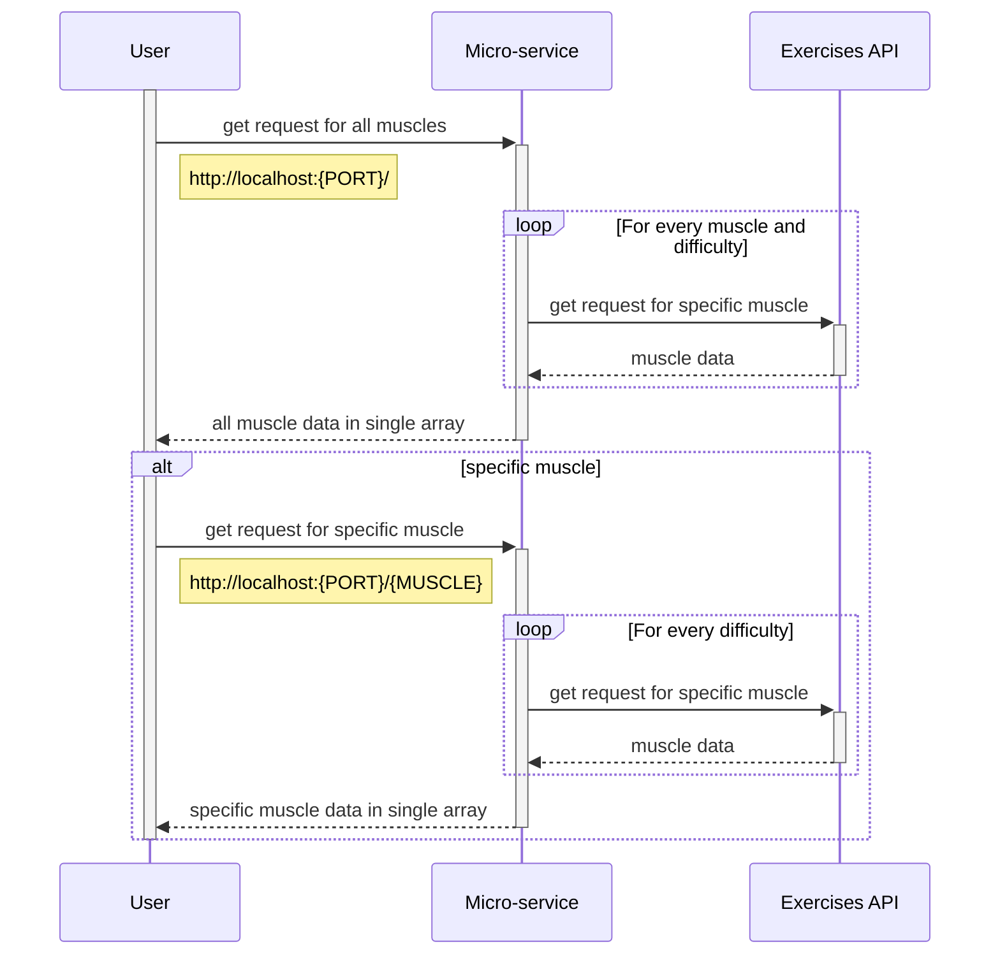

# CS361-Microservice

Setup before using micro-service:
1. You need node.js v16+ installed.
2. Create a free account at https://api-ninjas.com/.
3. Get your own API key under 'My Account' and 'API Key'.
4. Create .env file in the root directory and create the variables PORT and KEY.
5. Assign PORT to what port you want to host the micro-service in and KEY with the API key you got from step 3.
6. Run npm install in the root directory to create a node_modules folder with all dependencies needed.
7. Inside of server.mjs, you need to change the constant hostURL to the URL your program will call this micro-service from.
8. Lastly, run npm start in the root directory to start the server.

How to Request Data from Micro-service:
1. Create a URL as http://localhost:{PORT}/ or http://localhost:PORT/{muscle}.
2. Change {PORT} to whatever port you gave the micro-service and {muscle} to any muscle 
under the muscle section in https://api-ninjas.com/api/exercises.
3. Send an HTTP get request to the URL you created.

How to Receive Data from Micro-service:
1. After sending the get request above, you will receive an HTTP response.
2. The body of the HTTP response is formatted as an array where each element is an object
with key: value pairs exactly like the example in https://api-ninjas.com/api/exercises.
3. Use that body for whatever purposes you may have.

